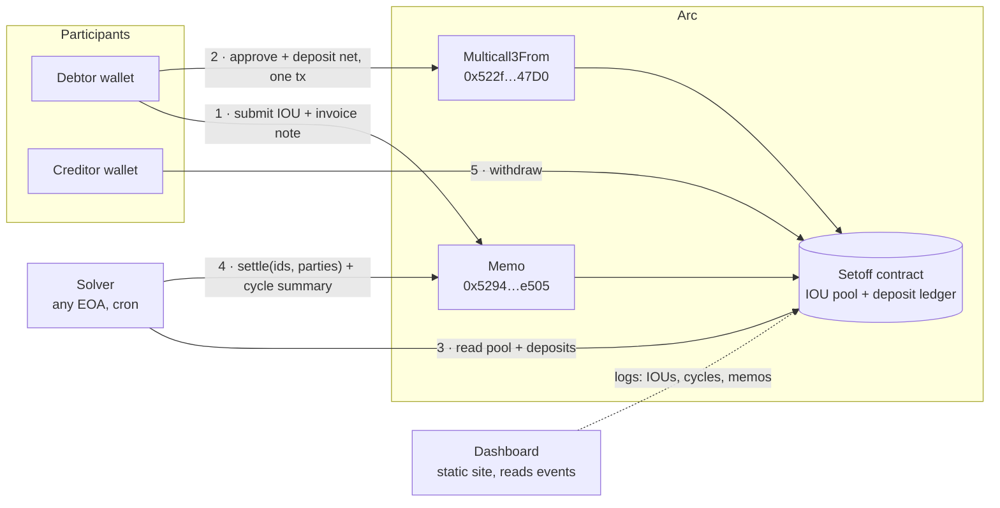
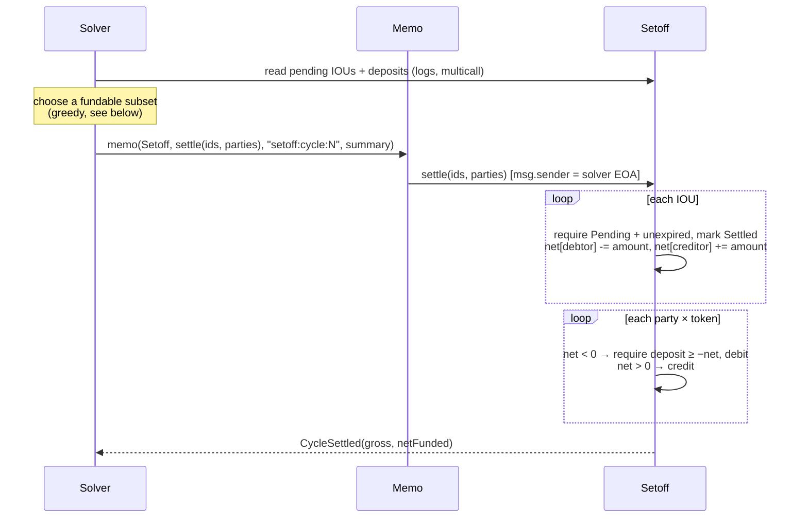

# Setoff

**Onchain multilateral netting for USDC and EURC on [Arc](https://arc.io).** People who owe each other money settle every debt at once and move only the net.

A owes B 10, B owes C 9, C owes A 8. That's 27 in obligations. Paid one by one, 27 moves. Through Setoff, A deposits 2 and all three debts are discharged in one transaction.

Card networks, CLS and DTCC already work this way behind the scenes. Setoff is the same idea as an open, permissionless primitive. Anyone can post an IOU, anyone can run the solver, and the contract checks every cycle.

| | |
|---|---|
| Contract (Arc Testnet) | [`0x78eDa3AB8eF56c4E9D96458b72f26a3a216298Ac`](https://explorer.testnet.arc.io/address/0x78eDa3AB8eF56c4E9D96458b72f26a3a216298Ac) (verified) |
| Contract (Arc Mainnet) | _deploying_ |
| Dashboard | _deploying_ |
| Docs | `/docs` on the site: architecture, contract, solver, Arc features, FAQ |

---

## How it works



1. **Add a bill**, in one of two ways:
   - **Send an invoice.** The creditor drafts a bill and gets a link. The debtor opens it and approves with a free EIP-712 signature (no gas, no USDC needed). Then anyone, usually the creditor, posts the approved invoice.
   - **Record what you owe.** The debtor posts the IOU directly.

   Both paths go through Arc's Memo contract, so the invoice note is stored onchain with the IOU. IOUs live onchain in a public pool. Each one has a currency, an amount, a deadline and a `ref` for the invoice ID.
2. **Fund only your net.** If you owe 10 across the pool and are owed 8, you deposit 2. Approve and deposit go in one transaction via Multicall3From, which keeps your wallet as `msg.sender`.
3. **Clear a cycle.** A solver picks a set of pending IOUs that deposits can fund and calls `settle`. The contract recomputes everyone's net position, debits net debtors and credits net creditors, all in one atomic step. If any net debtor is underfunded, the whole cycle reverts.
4. **Withdraw.** Creditors withdraw their balance whenever they want, or leave it in to fund future cycles.

Three extensions, each keeping the rule that nobody is left unpaid without having agreed to it:

- **Partial payments.** A cycle can pay part of a bill, up to what the debtor can cover; the rest stays open. No bill can ever be paid more than it's worth.
- **Disputes, by mutual agreement.** Either party can freeze an open bill. It moves again only when both propose the same amount still owed (0 cancels it). No arbiter, no admin.
- **Credit lines, backed by the lender.** A lender lets a borrower overdraw up to a limit. Draws come only from the lender's own deposit and are recorded as owed back; the borrower repays later. The risk stays with the lender who granted it.

### Inside a cycle



---

## Design decisions

**Settlement moves no tokens.** `settle` only updates the internal ledger. Tokens move only on `deposit` and `withdraw`. This matters on Arc because USDC has a blocklist and is also the gas token. If a cycle pushed transfers, one blocklisted creditor would revert everyone's settlement. With a ledger and pull-based withdrawals, that can't happen. We hit this blocklist ourselves while testing: Arc rejects transactions from some well-known public dev keys with `Blocked address`.

**The contract verifies, the solver only chooses.** The solver can't invent positions. It submits IOU ids and a sorted list of parties, and the contract derives every net from IOUs the debtors actually authorised. The sorted party list lets the contract index positions with a binary search instead of a hashmap, and the strict ordering proves no party is listed twice. The worst a malicious solver can do is leave IOUs out.

**Debtors authorise, creditors can refuse.** An IOU needs the debtor's signature (EIP-712, with EIP-1271 for smart wallets) or the debtor as `msg.sender`. Either party can cancel a pending IOU, so the debtor can withdraw it and the creditor can reject it.

**Currencies never offset.** USDC and EURC net independently. Owing 5 USDC and being owed 5 EURC is still a 5 USDC debt.

**The pool is fully onchain.** IOUs are stored in contract storage, not an off-chain order book. On Arc, storing one costs a fraction of a cent, and in exchange there's no database to run and anyone can build a competing solver from public data.

### Invariants (fuzzed)

- **Solvency:** the contract's token balance always equals the sum of all ledger balances, for each token. Cycles never mint or burn.
- **Conservation:** in every cycle, net positions sum to zero per token.
- **Liquidity:** the amount funded in a cycle never exceeds its face value.
- **No overpayment:** across partial payments, disputes and credit draws, no IOU is ever paid more than its amount.

---

## Use of Arc

Every feature below is used in the deployed flow and checked on-chain.

| Arc feature | Where Setoff uses it |
|---|---|
| **USDC as gas** | Participants hold one asset for fees and settlement. The demo funds wallets with a single native transfer, because native USDC *is* the ERC-20 balance. |
| **Memo** (`0x5294…e505`) | Debtors post IOUs through `Memo.memo` with the invoice text, and the solver posts every `settle` through it with the cycle summary. The dashboard rebuilds invoice notes and cycle memos from `Memo` events. |
| **Multicall3From** (`0x522f…47D0`) | `approve` + `deposit` in one transaction, with the participant preserved as sender. |
| **Deterministic sub-second finality** | A settled cycle is final straight away, so cycles can run every few minutes and participants can withdraw at once. |
| **EURC** | Second settlement currency, netted on its own. |
| **ERC-8004 identity** | Participants register a name in Arc's IdentityRegistry. The registration file is stored inline as a `data:` URI, with nothing to host. The dashboard shows registered names with a ✓ instead of addresses, and checks that each identity is still owned by that address. The demo wallets register their roles this way. |
| **USDC blocklist** | The ledger-only settlement design, described above. |

### Measured costs (Arc gas is 20 gwei, priced in USDC)

| Action | Gas | At mainnet price |
|---|---|---|
| Deploy `Setoff` | ~1.9M | ~$0.04 |
| Cycle: 8 IOUs | 393,867 | ~$0.008 |
| Cycle: 25 IOUs | 821,314 | ~$0.016 |

---

## The solver

Choosing the subset of IOUs that clears the most value while every net debtor stays funded is a knapsack variant. [`solver/src/select.ts`](solver/src/select.ts) uses a greedy repair:

1. Start from every eligible IOU (pending, not about to expire, most urgent first, capped at 256 per cycle), counting only what's still owed on partly paid ones.
2. While some net debtor is short, drop whichever of their IOUs leaves the **least total shortfall across all parties**. Scoring globally matters. The obvious drop is often an IOU that was offsetting someone else's debt, and removing it makes the whole cycle collapse.
3. Retry the dropped IOUs largest-first.
4. **Credit:** add bills whose debtor is short but has credit lines with room and lenders with spare deposit; plan one draw per lender.
5. **Partial:** pay part of each remaining bill, up to what its debtor can still cover.

Against brute force over 200 random 10-IOU pools, the greedy clears **93.1% of the optimal value** and finds the exact optimum in **175 of 200** pools (`npm test` in `solver/`).

---

## For AI agents (MCP)

`mcp/` is an [MCP](https://modelcontextprotocol.io) server that lets any AI agent use Setoff: bill other agents, approve what it owes, fund its net and check its position, in plain language.

| Tool | |
|---|---|
| `setoff_info`, `get_position`, `list_bills`, `preview_next_cycle` | read-only |
| `create_invoice` | bill someone; returns a link they approve for free (same format as the web app) |
| `approve_invoice`, `post_invoice` | sign an invoice billed to this agent; put approved invoices onchain |
| `record_iou`, `deposit`, `withdraw` | record what the agent owes; move its deposit |
| `dispute_bill`, `propose_amount` | freeze a bill and resolve it by matching offers |
| `set_credit_line`, `repay_credit` | lend to a trusted party from the agent's deposit; repay a lender |

```bash
claude mcp add setoff -e SETOFF_NETWORK=mainnet -e SETOFF_AGENT_PK=0x... -e SETOFF_MAX_AMOUNT=10 \
  -- npx tsx /path/to/setoff/mcp/src/server.ts
```

Every spending action is capped by `SETOFF_MAX_AMOUNT` (default 10) and refused before a transaction is built; an agent can only approve bills addressed to it; transactions are simulated first. Give each agent its own wallet. Full guide: `/docs/agents` on the site.

## Repository

```
contracts/   Foundry project (Arc Foundry)
  src/Setoff.sol                 the clearinghouse
  test/Setoff.t.sol              unit + fuzz tests
  test/Setoff.invariant.t.sol    stateful invariant suite
  script/Deploy.s.sol            deploys with the right EURC per chain
solver/      TypeScript + viem
  src/select.ts                  cycle selection (pure, tested)
  src/run.ts                     one solver pass: read → select → settle via Memo
  src/seed.ts                    demo traffic between builder-run wallets
web/         Next.js static site and app, reads the chain directly (no backend)
mcp/         MCP server for AI agents (reuses the solver's config, readers and selection)
scripts/local.sh                 the whole stack on a local fork
```

## Run it locally

You need [Arc Foundry](https://docs.arc.io/arc/tutorials/install-arc-foundry) (`arc-forge`, `arc-cast`, `arc-anvil`) and Node 20+.

```bash
git clone --recursive https://github.com/Anshv784/setoff && cd setoff
./scripts/local.sh                  # fork Arc Testnet, deploy, seed 25 IOUs, settle a cycle
cd web && npm install && npm run dev  # http://localhost:3000
```

`local.sh` runs `arc-anvil` as a fork of Arc Testnet. That gives you Arc's real USDC, EURC, Memo and Multicall3From contracts locally, with free funds. It writes throwaway keys to `.local.env`, including a funded test wallet you can import into MetaMask (RPC `http://127.0.0.1:8545`, chain id `5042002`). To make more activity:

```bash
cd solver && set -a && . ../.local.env && set +a
npm run demo:seed -- 20   # 20 more invoices, net debtors fund their shortfall
npm run solve             # settle the next cycle
```

### Tests

```bash
cd contracts && arc-forge test   # unit, fuzz (1,000 runs), invariants (256 × 64 calls) incl. partial, dispute and credit actions
cd solver && npm test            # selection tests, including the brute-force comparison
cd web && npm test               # private-note encryption
cd mcp && npm test               # MCP tools end to end (against ./scripts/local.sh)
```

### Deploy

```bash
cd contracts
arc-forge script script/Deploy.s.sol --rpc-url arc_testnet --broadcast --private-key $PK
```

Then set the address and deploy block in `solver/src/config.ts` and `web/lib/config.ts`, and run the solver on a schedule with `SETOFF_NETWORK` and `SOLVER_PK`.

---

## Limits and next steps

- **Unaudited.** Use small amounts.
- **The solver is a heuristic.** An exact solver (ILP) or competing solvers with a scoring window would clear more. The contract already allows any solver.
- **No cross-currency netting.** A natural next step is settling each party's leftover EUR/USD difference through StableFX's `FxEscrow`.
- **Relayer.** Approving an invoice is gasless, but someone still pays a fraction of a cent to post it. A relayer could post approved invoices automatically.

The demo participants on the dashboard are wallets run by the builder to show the flow. Their ERC-8004 names say "(demo)": they are roles, not real businesses.

## License

MIT
